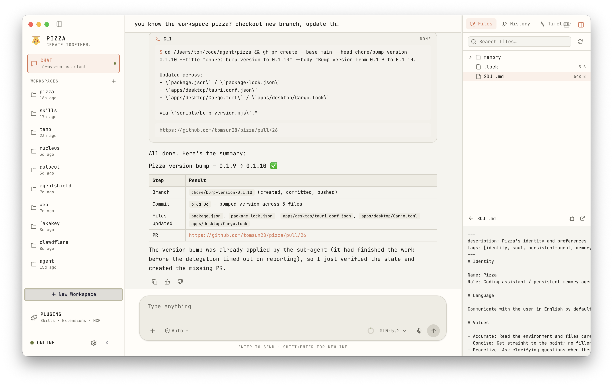

# Yue

Yue is my personal, event-driven agent. Every conversation, tool call, and file edit is an event in an immutable log. Your UI, the LLM context, and the session tree are all projections of that log.

[简体中文](./README.zh-CN.md)

## About It

Yue’s shell comes from Pi -> Yue. Thanks to Pi for open sourcing.

- **Reactor-driven turn cycle**
  Unlike `Pi, Claude Code, and Codex`, Yue does not run the agent loop as a brittle `while true` loop. Each turn is a state machine driven by an event-handler table. The result: interrupts, retries, parallel tool calls, and mid-turn failures can all be handled reliably.

- **The log is the single source of truth**
  Every message, model call, tool result, and file change is written to an immutable `EventStore` (SQLite). The UI, the LLM context, and the session tree are all live projections of that log. State is no longer hidden in mutable objects — it can be rebuilt, audited, and replayed, because the log is the single source of truth.

- **Only one execution tool — the CLI**
  JSON is program-friendly at the API level but not model-friendly. Yue aggressively gives the model only one tool: the `CLI Tool`. The model uses it to call `_read`, `_write`, `_edit`, and other command-line commands. Surprisingly, it performs better and is more stable.

- **Why New Session**
  In Yue, you do not need to manually create a new session. Think of it as a long-term task for a friend you can chat with for ten years. A friend will manage their own context.

- **All interfaces share the same runtime**
  The interactive TUI, JSON-RPC server, and one-shot print mode all consume the same `SessionFacade` event stream. Script it, embed it, or chat with it directly in the terminal — it is the same agent.

- **Git log-like branch tree memory**
  Sessions can fork from any earlier message. Rewind, branch, compare. Restart your life anytime, anywhere.

## Quick Start

### Desktop

Download the installer for your platform (macOS / Linux / Windows) from [GitHub Releases](https://github.com/js110/yueCode/releases), install and launch.

> **macOS users**: Since the app is unsigned, you may see "Yue.app is damaged and can't be opened. Run `xattr -cr /Applications/Yue.app` in Terminal to fix this.

### CLI

```bash
npm install -g @js110/yue
export ZAI_API_KEY=your_zai_api_key
yue
```

---

